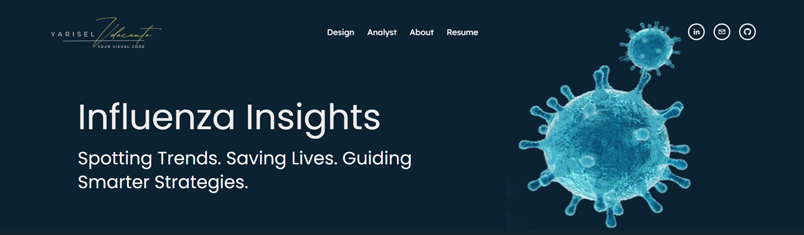

# 🦠 Influenza Insights: A Data-Driven Analysis

**Spotting Trends. Saving Lives. Guiding Smarter Strategies.**

This project explores flu mortality trends across the U.S. using public datasets — with a strong focus on highlighting vulnerable groups, vaccine gaps, and regional disparities. It’s a mix of data cleaning, statistical analysis, and clear visuals to help make real-world patterns easier to act on.

---

## 🔍 Fast Facts for Busy Reviewers

- **Tool Stack:** SQL (pgAdmin), Excel, Tableau  
- **Data Size:** 100k+ population records  
- **Key Wins:**
  - Uncovered states and groups with highest flu vulnerability
  - Merged CDC, Census, and survey data for deeper insights
  - Designed polished, interactive Tableau dashboards

---

## 🎯 The Challenge

Governments and public health orgs need stronger, earlier signals to answer:
- **Who’s most at risk?**
- **Where are the biggest gaps in protection?**

This project approached those questions with three core goals:
1. Uncover vulnerable populations  
2. Explore vaccine & testing disparities  
3. Highlight actionable prevention opportunities  

---

## 🧹 Data Cleaning Highlights

Working with large datasets from CDC and NIS required:
- **Missing value handling** for deaths, census, and survey inputs  
- **Date formatting** and region standardization  
- **Filtering & grouping** based on age, risk, and income  

> Tools Used: Excel (cleaning), SQL (querying), Tableau (visualization)

---

## 📊 Key Visuals & What They Show

- 🗺️ **Mortality by State:** Who’s hit hardest?  
- 📈 **Age Breakdown:** Seniors vs. infants — who’s most vulnerable?  
- 💉 **Vaccine vs. Mortality:** Are more shots saving lives?  
- 🧬 **Risk Factors:** How do chronic conditions shift the numbers?

---

## 🧠 Main Insights (Recap)

- **Low Vaccine Rates → High Mortality**  
  States with low flu shot uptake saw up to 2x higher death rates.

- **Seniors & Infants at Higher Risk**  
  Most deaths occurred in people 65+ and children under 5.

- **Income & Access Gaps**  
  Communities with less healthcare access faced worse outcomes.

---

## 📌 From Data to Decisions

Based on this analysis, I’d recommend:
1. **Targeting outreach** in low-vaccine rural areas  
2. **Prioritizing seniors & children** in campaigns  
3. **Using census + CDC data** to refine future health policy  

---

## 🛠️ Technologies Used

- **SQL** (PostgreSQL via pgAdmin)  
- **Excel** for shaping/cleaning datasets  
- **Tableau** for visuals & storytelling

---

## 📁 Repository Structure

Influenza Insights: A Data-Driven Analysis/
│
├── Data Visualization & Storytelling 2.1–2.10/       → Excel files, lesson PDFs, and Tableau dashboards
│   ├── Data/                                          → Cleaned and raw Excel datasets
│   ├── Docs/                                          → Project answers, research notes, submission PDFs
│   └── Tableau/                                       → Workbook (.twb) files and data extracts (.hyper)
│
├── Preparing & Analyzing Data 1.1–1.10 Project/       → Pre-cleaning, milestone reports, final interim write-up
│   ├── Data/                                          → Raw and cleaned Excel datasets
│   ├── Excel Analysis/                                → Reflections, analysis notes, topic docs
│   └── Submissions/                                   → Interim report (.docx) for 1.10
│
└── SQL Influenza Mortality Trends/                    → Queries and visuals for flu mortality SQL analysis
    ├── Data/                                          → Cleaned and raw CSV datasets
    ├── SQL/                                           → Query scripts and PDF report
    └── Docs/                                          → Final write-up (PDF format)

